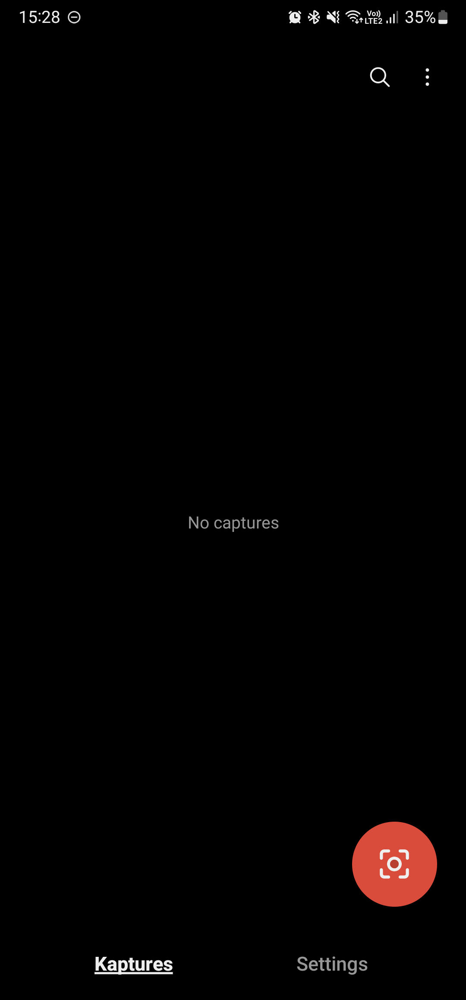
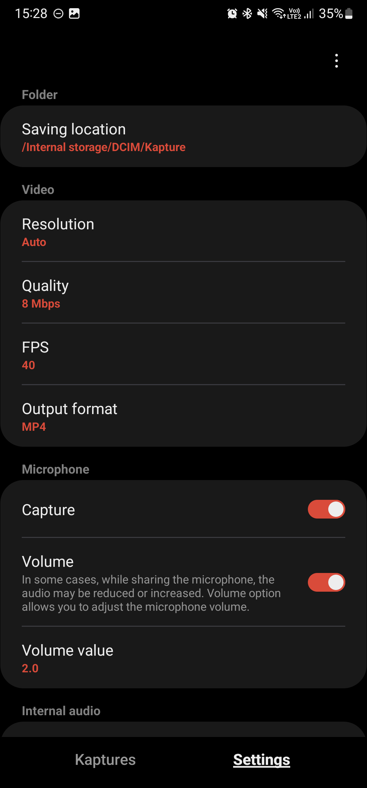
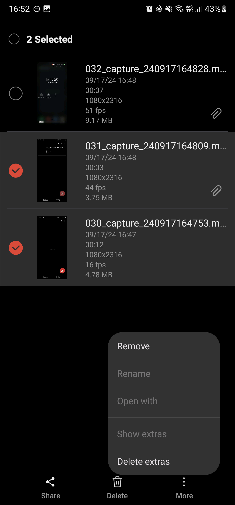
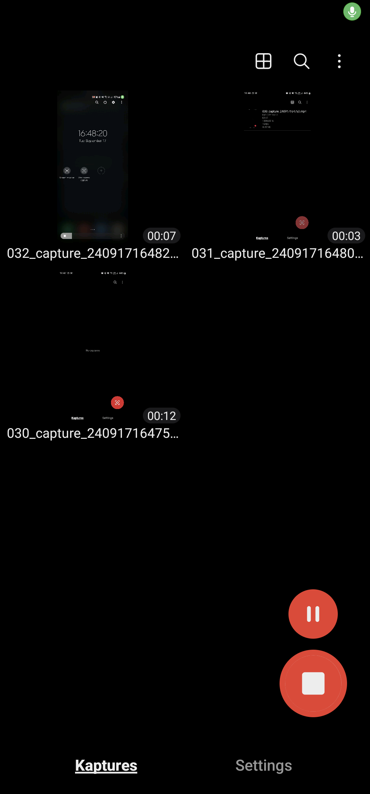
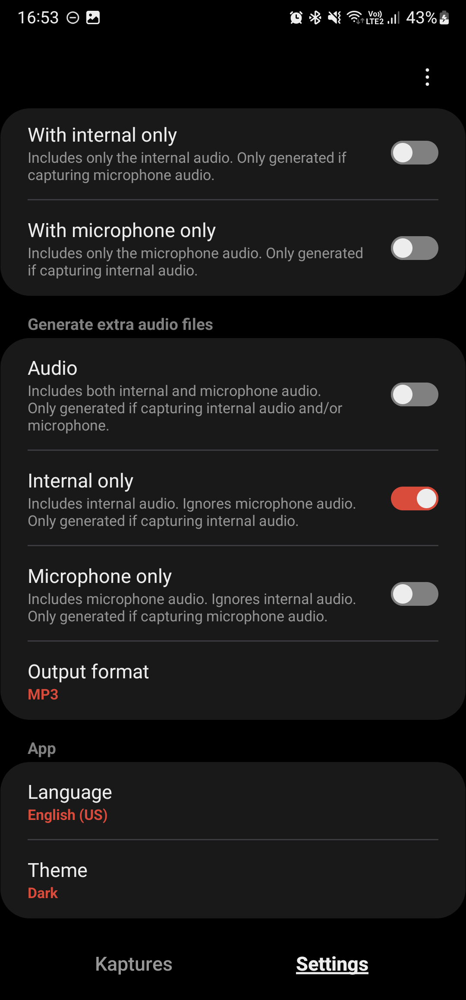
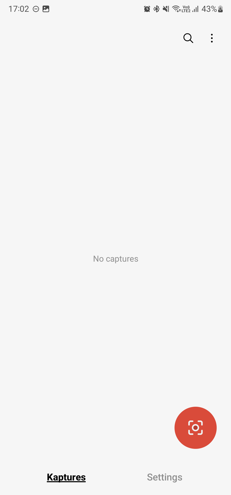
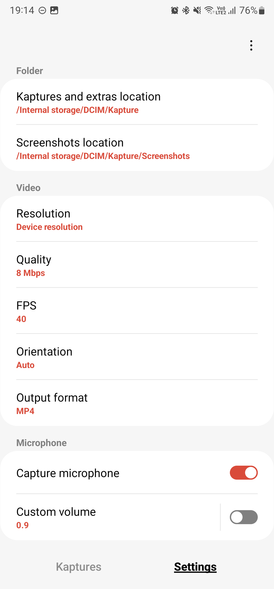
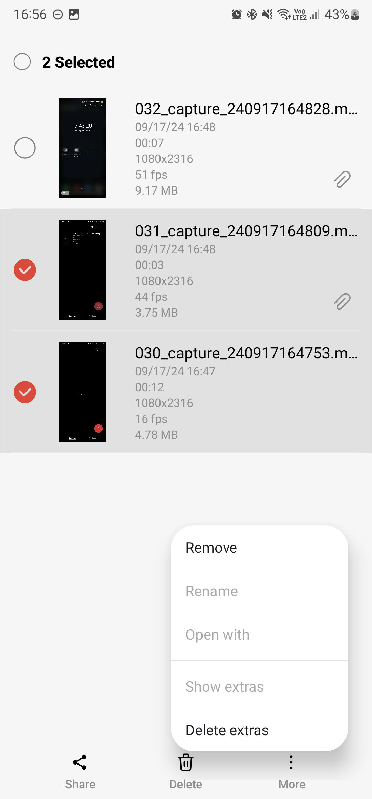
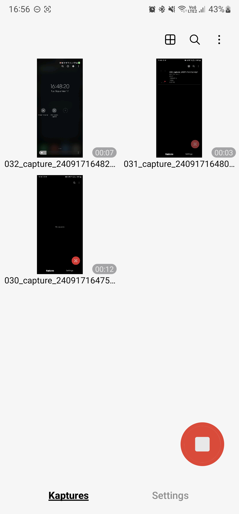
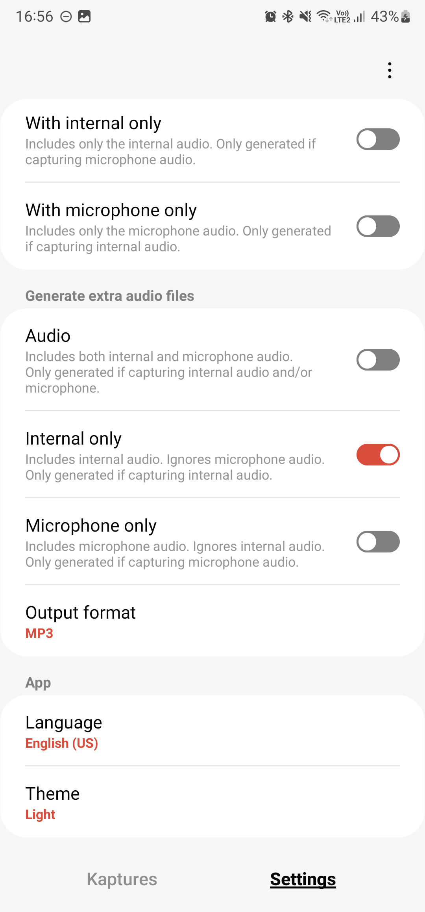

# Kapture - Screen recorder   
Change README language: 

 
 
Kapture is a screen recorder for android that allows to capture microphone audio while sharing it with other apps.
 
 
I was looking for an app that allow me to record my screen and microphone while sharing the microphone with other apps, like games.
Unfortunately I didn't find any inside the Google Play.
The ones I found required sideload, which I was a bit concerned about installing because it required some dangerous permissions and I didn't have access to the code.
Therefore I decided to build one on my own. I'm also sharing it here. You can download the .apk and install it, or you can download the source code, read it and built it yourself.
 
 
    
    
##
### Features
<ul>
  <li>Capture the screen:
    <ul>
      <li>Set resolution;</li>
      <li>Set quality (bit rate);</li>
      <li>Set recording FPS.</li>
    </ul>
  </li>
  <li>Capture internal audio (if the app that is playing the audio allows it to be captured):
    <ul>
        <li>Capture in mono or stereo.</li>
    </ul>
  </li>
  <li>Capture microphone audio (while sharing with other apps):
    <ul>
      <li>Increase/decrease volume.</li>
    </ul>
  </li>
  <li>Floating UI;</li>
  <li>Generate extra video files:
   <ul>
      <li>Without audio;</li>
      <li>With internal audio only;</li>
      <li>With microphone audio only.</li>
    </ul>
  </li>
  <li>Generate extra audio files:
    <ul>
      <li>Both audio;</li>
      <li>Internal audio only;</li>
      <li>Microphone audio only.</li>
    </ul>
  </li>
  <li>Notification shortcuts;</li>
  <li>Quick tile shortcut;</li>
  <li>Manage all captures made by the app:
    <ul>
      <li>Check info like resolution, date of creation, size, ...</li>
      <li>Remove from the app;</li>
      <li>Delete file(s) from the device;</li>
      <li>Check related files (extra files generated);</li>
      <li>Rename;</li>
      <li>Share.</li>
    </ul>
  </li>
  <li>Internal viewer (player):
     <ul>
       <li>Audio player;</li>
       <li>Video player.</li>
     </ul>
  </li>
  <li>Set app language (auto or manually):
   <ul>
      <li>English</li>
      <li>Português (Brasil).</li>
    </ul>
  </li>
  <li>Light and dark mode (auto or manually).</li>
</ul>

##
### Sharing microphone
According to the Android <a href="https://developer.android.com/media/platform/sharing-audio-input" target="_blank" rel="noreferrer">documentation</a>, after the Android 10/11, apps can only share the microphone input between them in specific cases.
 
 
Kapture is built over an accessibility service, turning it into a specific case, like mentioned <a href="https://developer.android.com/media/platform/sharing-audio-input#accessibility_service_ordinary_app" target="_blank" rel="noreferrer">here</a> in the android docs.

##
### Android permissions (required to use)
<ul>
  <li>Microphone: Used to capture the microphone and internal audio:
    <ul>
      <li>android.permission.RECORD_AUDIO</li>
    </ul>
  </li>
  <li>Notification: Used to show notifications and start the foreground service:
    <ul>
      <li>android.permission.POST_NOTIFICATIONS</li>
    </ul>
  </li>
  <li>Storage: Used to create and manage the files:
    <ul>
      <li>android.permission.WRITE_EXTERNAL_STORAGE</li>
      <li>android.permission.READ_EXTERNAL_STORAGE</li>
      <li>android.permission.MANAGE_EXTERNAL_STORAGE</li>
    </ul>
  </li>
  <li>Secure settings: Used to share the microphone with other apps and start the accessibility service:
    <ul>
      <li>android.permission.WRITE_SECURE_SETTINGS</li>
      <li>android.permission.FOREGROUND_SERVICE</li>
    </ul>
  </li>
  <li>Internet: Used to search for updates (does not auto update) and to open external links:
    <ul>
      <li>android.permission.INTERNET</li>
    </ul>
  </li>
</ul>

##
### Installing
#### Option 1:
- Download the source code, or clone this repository, and build the app using Android Studio.

#### Option 2:
<ul>
  <li>You can download the latest version .apk <a href="https://drive.google.com/file/d/1AEqt_hSIK_aScnwetbHdyyotKN8RdtME/view" target="_blank" rel="noreferrer">here</a>*;</li>
  <li>You can check all previous versions .apk links for download <a href="https://github.com/hms-douglas/kapture/blob/master/dist/all.json" target="_blank" rel="noreferrer">here</a>*.</li>
</ul>
* All .apks listed here were built by me, are not minimified and are hosted on Google Drive.

##
### Log
<b>v1.0.0</b>
<ul>
  <li>Release.</li>
</ul>

##
### Donations
- If you would like to support me, you can make a donation clicking on the button bellow... Thank you! ❤️

##
### License
Copyright 2024 Douglas Silva

   Licensed under the Apache License, Version 2.0 (the "License");
   you may not use this file except in compliance with the License.
   You may obtain a copy of the License at

     http://www.apache.org/licenses/LICENSE-2.0

   Unless required by applicable law or agreed to in writing, software
   distributed under the License is distributed on an "AS IS" BASIS,
   WITHOUT WARRANTIES OR CONDITIONS OF ANY KIND, either express or implied.
   See the License for the specific language governing permissions and
   limitations under the License.
