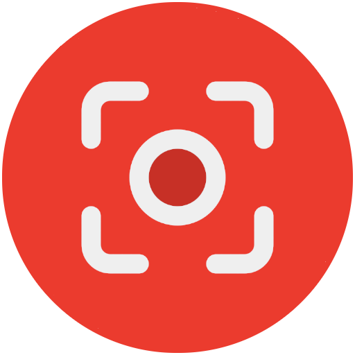

[![lang](https://img.shields.io/badge/English-gray.svg?logo=data:image/svg%2bxml;base64,PD94bWwgdmVyc2lvbj0iMS4wIj8+Cjxzdmcgd2lkdGg9IjMyIiBoZWlnaHQ9IjMyIiB4bWxucz0iaHR0cDovL3d3dy53My5vcmcvMjAwMC9zdmciIHhtbG5zOnN2Zz0iaHR0cDovL3d3dy53My5vcmcvMjAwMC9zdmciPgogPGcgY2xhc3M9ImxheWVyIj4KICA8dGl0bGU+TGF5ZXIgMTwvdGl0bGU+CiAgPHJlY3QgZmlsbD0iI2ZmZiIgaGVpZ2h0PSIyNCIgaWQ9InN2Z18xIiByeD0iNCIgcnk9IjQiIHdpZHRoPSIzMCIgeD0iMSIgeT0iNCIvPgogIDxwYXRoIGQ9Im0xLjY0LDUuODVsMjguNzIsMGMtMC43MSwtMS4xMSAtMS45NSwtMS44NSAtMy4zNiwtMS44NWwtMjIsMGMtMS40MSwwIC0yLjY1LDAuNzQgLTMuMzYsMS44NXoiIGZpbGw9IiNhNjI4NDIiIGlkPSJzdmdfMiIvPgogIDxwYXRoIGQ9Im0yLjA4LDguMjljLTAuMDEsMC4xNyAtMC4wMywwLjM0IC0wLjAzLDAuNTNsMCwyLjY1bDI5LDBsMCwtMi42NWMwLC0wLjE5IC0wLjAyLC0wLjM0IC0wLjAzLC0wLjUzbC0yOC45NCwweiIgZmlsbD0iI2E2Mjg0MiIgaWQ9InN2Z18zIi8+CiAgPHBhdGggZD0ibTIsMTQuMTFsMjksMGwwLDIuODFsLTI5LDBsMCwtMi44MXoiIGZpbGw9IiNhNjI4NDIiIGlkPSJzdmdfNSIgdHJhbnNmb3JtPSJtYXRyaXgoMSAwIDAgMSAwIDApIi8+CiAgPHBhdGggZD0ibTEsMTkuOTJsMzAsMGwwLDMuMjdsLTMwLDBsMCwtMy4yN3oiIGZpbGw9IiNhNjI4NDIiIGlkPSJzdmdfNiIgdHJhbnNmb3JtPSJtYXRyaXgoMSAwIDAgMSAwIDApIi8+CiAgPHBhdGggZD0ibTMwLjM2LDI2LjE1bC0yOC43MiwwYzAuNzEsMS4xMSAxLjk1LDEuODUgMy4zNiwxLjg1bDIyLDBjMS40MSwwIDIuNjUsLTAuNzQgMy4zNiwtMS44NXoiIGZpbGw9IiNhNjI4NDIiIGlkPSJzdmdfOCIvPgogIDxwYXRoIGQ9Im01LDRsMTEsMGwwLDEyLjkybC0xNSwwbDAsLTguOTJjMCwtMi4yMSAxLjc5LC00IDQsLTR6IiBmaWxsPSIjMTAyZDVlIiBpZD0ic3ZnXzkiLz4KICA8cGF0aCBkPSJtMjcsNGwtMjIsMGMtMi4yMSwwIC00LDEuNzkgLTQsNGwwLDE2YzAsMi4yMSAxLjc5LDQgNCw0bDIyLDBjMi4yMSwwIDQsLTEuNzkgNCwtNGwwLC0xNmMwLC0yLjIxIC0xLjc5LC00IC00LC00em0zLDIwYzAsMS42NSAtMS4zNSwzIC0zLDNsLTIyLDBjLTEuNjUsMCAtMywtMS4zNSAtMywtM2wwLC0xNmMwLC0xLjY1IDEuMzUsLTMgMywtM2wyMiwwYzEuNjUsMCAzLDEuMzUgMywzbDAsMTZ6IiBpZD0ic3ZnXzEwIiBvcGFjaXR5PSIwLjE1Ii8+CiA8L2c+Cjwvc3ZnPg==)](https://github.com/hms-douglas/kapture)
[![lang](https://img.shields.io/badge/Portugu%C3%AAs-gray.svg?logo=data:image/svg%2bxml;base64,PHN2ZyB4bWxucz0iaHR0cDovL3d3dy53My5vcmcvMjAwMC9zdmciIHdpZHRoPSIzMiIgaGVpZ2h0PSIzMiIgdmlld0JveD0iMCAwIDMyIDMyIj48cmVjdCB4PSIxIiB5PSI0IiB3aWR0aD0iMzAiIGhlaWdodD0iMjQiIHJ4PSI0IiByeT0iNCIgZmlsbD0iIzQ1OWE0NSI+PC9yZWN0PjxwYXRoIGQ9Ik0yNyw0SDVjLTIuMjA5LDAtNCwxLjc5MS00LDRWMjRjMCwyLjIwOSwxLjc5MSw0LDQsNEgyN2MyLjIwOSwwLDQtMS43OTEsNC00VjhjMC0yLjIwOS0xLjc5MS00LTQtNFptMywyMGMwLDEuNjU0LTEuMzQ2LDMtMywzSDVjLTEuNjU0LDAtMy0xLjM0Ni0zLTNWOGMwLTEuNjU0LDEuMzQ2LTMsMy0zSDI3YzEuNjU0LDAsMywxLjM0NiwzLDNWMjRaIiBvcGFjaXR5PSIuMTUiPjwvcGF0aD48cGF0aCBkPSJNMy40NzIsMTZsMTIuNTI4LDgsMTIuNTI4LTgtMTIuNTI4LThMMy40NzIsMTZaIiBmaWxsPSIjZmVkZjAwIj48L3BhdGg+PGNpcmNsZSBjeD0iMTYiIGN5PSIxNiIgcj0iNSIgZmlsbD0iIzBhMjE3MiI+PC9jaXJjbGU+PHBhdGggZD0iTTE0LDE0LjVjLS45OTcsMC0xLjk1OCwuMTQ5LTIuODczLC40MDktLjA3OCwuMzUtLjEyNiwuNzEtLjEyNywxLjA4MywuOTQ0LS4zMTUsMS45NTEtLjQ5MywyLjk5OS0uNDkzLDIuNTI0LDAsNC44MTYsLjk5Niw2LjUxOSwyLjYwOCwuMTUyLS4zMjYsLjI3Ni0uNjY2LC4zNTYtMS4wMjYtMS44NDQtMS42MDQtNC4yNDUtMi41ODMtNi44NzUtMi41ODNaIiBmaWxsPSIjZmZmIj48L3BhdGg+PHBhdGggZD0iTTI3LDVINWMtMS42NTcsMC0zLDEuMzQzLTMsM3YxYzAtMS42NTcsMS4zNDMtMywzLTNIMjdjMS42NTcsMCwzLDEuMzQzLDMsM3YtMWMwLTEuNjU3LTEuMzQzLTMtMy0zWiIgZmlsbD0iI2ZmZiIgb3BhY2l0eT0iLjIiPjwvcGF0aD48L3N2Zz4=)](https://github.com/hms-douglas/kapture/blob/master/readme/pt_br/README.md)

#  Kapture - Screen recorder

Kapture is a screen recorder for android that allows to capture microphone audio while sharing it with other apps.
 
 
I was looking for an app that allow me to record my screen and microphone while sharing the microphone with other apps, like games.
Unfortunately I didn't find any inside the Google Play.
The ones I found required sideload, which I was a bit concerned about installing because it required some dangerous permissions and I didn't have access to the code.
Therefore I decided to build one on my own. I'm also sharing it here. You can download the .apk and install it, or you can download the source code, read it and built it yourself.
 
 

¹ Gif was from version 1.4.0, new versions might be different (features might change between android versions!).
##
### Features
<ul>
  <li>Capture the screen:
    <ul>
      <li>Set resolution;</li>
      <li>Set quality (bit rate);</li>
      <li>Set orientation;</li>
      <li>Set recording FPS.</li>
    </ul>
  </li>
  <li>Capture internal audio (if the app that is playing the audio allows it to be captured):
    <ul>
        <li>Capture in mono or stereo.</li>
    </ul>
  </li>
  <li>Capture microphone audio (while sharing with other apps);</li>
  <li>Pause/Resume capturing;</li>
  <li>Profiles;</li>
  <li>Floating UI;
      <ul>
         <li>Menu (Stop, pause, screenshot, draw, minimize, close, time, time limit, camera);</li>
         <li>Camera (front, back / extra styles);</li>
         <li>Text (extra styles);</li>
         <li>Draw (extra styles).</li>
         <li>Image;</li>
         <li>App shortcuts.</li>
      </ul>
   </li>
  <li>Generate extra video files:
   <ul>
      <li>Without audio;</li>
      <li>With internal audio only;</li>
      <li>With microphone audio only.</li>
    </ul>
  </li>
  <li>Generate extra audio files:
    <ul>
      <li>Both audio;</li>
      <li>Internal audio only;</li>
      <li>Microphone audio only.</li>
    </ul>
  </li>
  <li>Notification shortcuts;</li>
  <li>Quick tile shortcut:
    <ul>
      <li>Start/stop capturing;</li>
      <li>WiFi share.</li>
    </ul>
  </li>
  <li>Widgets:
    <ul>
      <li>Basic - Start/Stop;</li>
      <li>Full - Start/Stop and Pause/Resume;</li>
      <li>WiFi Share shortcut;</li>
      <li>Profiles shortcut;</li>
    </ul>
  </li>
  <li>Launcher static shortcuts;</li>
  <li>Manage all captures made by the app:
    <ul>
      <li>Check info like resolution, date of creation, size, ...</li>
      <li>Remove from the app;</li>
      <li>Delete file(s) from the device;</li>
      <li>Check related files (extra files generated);</li>
      <li>Rename;</li>
      <li>Share.</li>
    </ul>
  </li>
  <li>WiFi share;</li>
  <li>Countdown to start capturing;</li>
  <li>Multiple auto stop options;</li>
  <li>Multiple auto before start options;</li>
  <li>Internal viewer (player):
     <ul>
       <li>Audio player;</li>
       <li>Video player.</li>
     </ul>
  </li>
  <li>App language:
   <ul>
      <li>English</li>
      <li>Português (Brasil).</li>
    </ul>
  </li>
  <li>Light and dark mode (auto or manually).</li>
  <li>Storage control.</li>
  <li>Tablet UI.</li>
</ul>

##
### Sharing microphone
According to the Android <a href="https://developer.android.com/media/platform/sharing-audio-input" target="_blank" rel="noreferrer">documentation</a>, after the Android 10/11, apps can only share the microphone input between them in specific cases.
 
 
Kapture is built over an accessibility service, turning it into a specific case, like mentioned <a href="https://developer.android.com/media/platform/sharing-audio-input#accessibility_service_ordinary_app" target="_blank" rel="noreferrer">here</a> in the android docs.

##
### Android permissions (required to use)
<ul>
  <li>Microphone: Used to capture the microphone and internal audio:
    <ul>
      <li>android.permission.RECORD_AUDIO</li>
    </ul>
  </li>
  <li>Notification: Used to show notifications and start the foreground service:
    <ul>
      <li>android.permission.POST_NOTIFICATIONS</li>
    </ul>
  </li>
  <li>Storage: Used to create and manage the files:
    <ul>
      <li>android.permission.WRITE_EXTERNAL_STORAGE</li>
      <li>android.permission.READ_EXTERNAL_STORAGE</li>
      <li>android.permission.MANAGE_EXTERNAL_STORAGE</li>
    </ul>
  </li>
  <li>Secure settings: Used to share the microphone with other apps and start the accessibility service:
    <ul>
      <li>android.permission.WRITE_SECURE_SETTINGS</li>
      <li>android.permission.FOREGROUND_SERVICE</li>
    </ul>
  </li>
  <li>Internet: Used to search for updates (does not auto update), to open external links and to share files over WiFi:
    <ul>
      <li>android.permission.INTERNET</li>
      <li>android.permission.ACCESS_NETWORK_STATE</li>
    </ul>
  </li>
  <li>Camera: Used to show the camera overlay:
    <ul>
      <li>android.permission.CAMERA</li>
    </ul>
  </li>
  <li>Optimization: Used as shortcut to disable the phone's battery optimization for the app:
    <ul>
      <li>android.permission.REQUEST_IGNORE_BATTERY_OPTIMIZATIONS</li>
    </ul>
  </li>
  <li>Packages: Used to launch apps and add shortcuts to the floating menu:
    <ul>
      <li>android.permission.QUERY_ALL_PACKAGES</li>
    </ul>
  </li>
</ul>

##
### Download the lastest apks¹ ² ³
[![apk](https://img.shields.io/badge/phone-v1.5.0-FBD75B?logo=data:image/svg%2bxml;base64,PHN2ZyB4bWxucz0iaHR0cDovL3d3dy53My5vcmcvMjAwMC9zdmciIGhlaWdodD0iMjRweCIgdmlld0JveD0iMCAtOTYwIDk2MCA5NjAiIHdpZHRoPSIyNHB4IiBmaWxsPSIjRkZGRkZGIj48cGF0aCBkPSJNNDgwLTM0Mi4wMnEtOC45NiAwLTE3LjE1LTMuMS04LjItMy4xLTE0LjkyLTkuODFMMzAwLjM1LTUwMi41MnEtMTMuNDQtMTMuNDQtMTMuMDYtMzEuODMuMzgtMTguMzkgMTMuMDYtMzEuODIgMTMuNjctMTMuNjggMzIuMzItMTQuMDYgMTguNjYtLjM4IDMyLjMzIDEzLjI5bDY5LjUgNjkuNXYtMjY1LjE5cTAtMTkuMTUgMTMuMTctMzIuMzMgMTMuMTgtMTMuMTcgMzIuMzMtMTMuMTd0MzIuMzMgMTMuMTdxMTMuMTcgMTMuMTggMTMuMTcgMzIuMzN2MjY1LjE5bDY5LjUtNjkuNXExMy40My0xMy42NyAzMi4wOS0xMy40MSAxOC42NS4yNiAzMi4zMiAxMy45NCAxMi45MiAxMy42NyAxMy4zIDMxLjk0LjM4IDE4LjI3LTEzLjMgMzEuOTVMNTEyLjA3LTM1NC45M3EtNi43MiA2LjcxLTE0LjkyIDkuODEtOC4xOSAzLjEtMTcuMTUgMy4xWk0yNDIuODctMTUxLjg3cS0zNy43OCAwLTY0LjM5LTI2LjYxdC0yNi42MS02NC4zOXYtNzQuNXEwLTE5LjE1IDEzLjE3LTMyLjMzIDEzLjE4LTEzLjE3IDMyLjMzLTEzLjE3dDMyLjMzIDEzLjE3cTEzLjE3IDEzLjE4IDEzLjE3IDMyLjMzdjc0LjVoNDc0LjI2di03NC41cTAtMTkuMTUgMTMuMTctMzIuMzMgMTMuMTgtMTMuMTcgMzIuMzMtMTMuMTd0MzIuMzMgMTMuMTdxMTMuMTcgMTMuMTggMTMuMTcgMzIuMzN2NzQuNXEwIDM3Ljc4LTI2LjYxIDY0LjM5dC02NC4zOSAyNi42MUgyNDIuODdaIi8+PC9zdmc+)](https://hms-douglas.github.io/kapture/dist/apks/phone/1.5.0.apk)

¹ All apks listed inside this repository were built by me and are not minified;
 
² Versions < 1.5.0 are stored on my google drive, versions >= 1.5.0 are stored inside the folder "/dist/apks/phone".
 
³ Link to all versions can be found <a href="https://github.com/hms-douglas/kapture/blob/master/dist/all.json" target="_blank" rel="noreferrer">here</a>.

##
### Installing
#### Option 1:
- Download the source code, or clone this repository, and build the app using Android Studio.

#### Option 2:
- Download the phone apk (link above) and manually install it on your phone¹;

¹ Google Play Protect might block the installation. In this case, disable it, install, then enable it.

##
### Donations
- If you would like to support me, you can use one of the options bellow... Thank you! ❤️

  
 

 Coin | Address
----|----|
Bitcoin | 3NkK4LMwMhKefe2phqf7Vrp1uQynu1Gs6x
Ethereum | 0xfea5dd21ebf73c5b4a2445c7713f6b5316dfac4d

##
### Log
<b>v1.5.0</b>
<ul>
   <li>FFmpegKit library was removed, as it was <a href="https://tanersener.medium.com/saying-goodbye-to-ffmpegkit-33ae939767e1">officially retired</a>;</li>
   <li>Option to make video seekable was removed (not needed anymore);</li>
   <li>Microphone custom volume option was removed;</li>
   <li>Option to block WiFi Share notification was added;</li>
   <li>Fixed a bug where the app was brought to foreground while using a quick tile in case the application was open in background;</li>
   <li>Fixed a bug where starting a capturing using widgets closes the app;</li>
   <li>Fixed a bug where actions from notification closes the app;</li>
   <li>Fixed a bug where multiple shortcuts of home screen was shown if the slot was empty;</li>
   <li>Minor UI changes;</li>
   <li>compileSdk updated to 34, for this reason some changes:
     <ul>
       <li>Recycle token feature is not available anymore on android >= 14 (google is now blocking it, as listed here in the <a href="https://developer.android.com/about/versions/14/behavior-changes-14#media-projection-consent">documentation</a>);</li>
       <li>Removed the option to capture single app on android >= 14 (this option was added by google on android 14 and was causing crashes).</li>
     </ul>
   </li>
</ul>
<b>v1.4.1</b>
<ul>
   <li>Fixed static shortcuts not working;</li>
   <li>Fixed auto orientation on DeX mode.</li>
</ul>
<b>v1.4.0</b>
<ul>
   <li>Quick tile for WiFi Share added;</li>
   <li>App shortcut added to floating menu;</li>
   <li>Password added to WiFi Share (+ "refresh password feature")</li>
   <li>Profiles added;</li>
   <li>Profiles widget added;</li>
   <li>Before start options added;</li>
   <li>Back to top button added to kaptures screen;</li>
   <li>Language is now manageable through the system menu;</li>
   <li>Notifications improved;</li>
   <li>Bug fix;</li>
   <li>Minor UI changes.</li>
</ul>
<b>v1.3.0</b>
<ul>
   <li>Auto stop option based on battery level added;</li>
   <li>Storage usage option added + Clear cache option;</li>
   <li>Image overlay added;</li>
   <li>Widgets added (Basic, Full, WiFi share);</li>
   <li>Option to control token recycling added;</li>
   <li>Option to make video seekable added inside the video viewer;</li>
   <li>Table UI support added;</li>
   <li>Draw overlay now supports colors with alpha channel;</li>
   <li>Draw overlay now supports screenshots (draw only and/or screen);</li>
   <li>FFmpegKit license changed from LGPL v3.0 to GPL v3.0;</li>
   <li>Bug fix;</li>
   <li>Minor UI changes.</li>
</ul>
<b>v1.2.0</b>
<ul>
   <li>Loading performance improved;</li>
   <li>Pause/resume option added;</li>
   <li>Launcher static shortcuts added.</li>
</ul>
<b>v1.1.0</b>
<ul>
   <li>Fixed notification actions not closing activity when action is completed;</li>
   <li>Fixed notification channel name;</li>
   <li>Fixed some translation errors;</li>
   <li>New menu overlay UI;</li>
   <li>Camera overlay added;</li>
   <li>Text overlay added;</li>
   <li>Draw overlay added;</li>
   <li>WiFi share added;</li>
   <li>Countdown to start added;</li>
   <li>Auto stop options added;</li>
   <li>Screenshot (print screen) while capturing added;</li>
   <li>Option to enable/disable some notifications added;</li>
   <li>Capturing orientation added;</li>
   <li>Option to ignore phone's battery optimization added;</li>
   <li>UI updated;</li>
   <li>Credits updated.</li>
</ul>
<b>v1.0.0</b>
<ul>
  <li>Release.</li>
</ul>

##
### License
Copyright 2024 Douglas Silva

   Licensed under the Apache License, Version 2.0 (the "License");
   you may not use this file except in compliance with the License.
   You may obtain a copy of the License at

     http://www.apache.org/licenses/LICENSE-2.0

   Unless required by applicable law or agreed to in writing, software
   distributed under the License is distributed on an "AS IS" BASIS,
   WITHOUT WARRANTIES OR CONDITIONS OF ANY KIND, either express or implied.
   See the License for the specific language governing permissions and
   limitations under the License.
