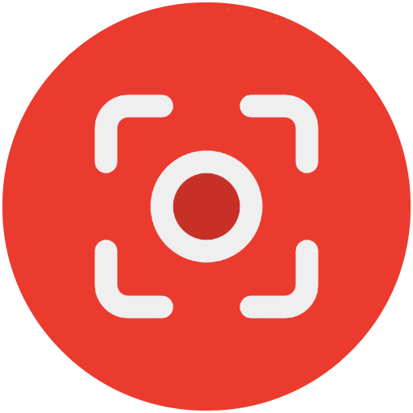

[![lang](https://img.shields.io/badge/English-gray.svg?logo=data:image/svg%2bxml;base64,PD94bWwgdmVyc2lvbj0iMS4wIj8+Cjxzdmcgd2lkdGg9IjMyIiBoZWlnaHQ9IjMyIiB4bWxucz0iaHR0cDovL3d3dy53My5vcmcvMjAwMC9zdmciIHhtbG5zOnN2Zz0iaHR0cDovL3d3dy53My5vcmcvMjAwMC9zdmciPgogPGcgY2xhc3M9ImxheWVyIj4KICA8dGl0bGU+TGF5ZXIgMTwvdGl0bGU+CiAgPHJlY3QgZmlsbD0iI2ZmZiIgaGVpZ2h0PSIyNCIgaWQ9InN2Z18xIiByeD0iNCIgcnk9IjQiIHdpZHRoPSIzMCIgeD0iMSIgeT0iNCIvPgogIDxwYXRoIGQ9Im0xLjY0LDUuODVsMjguNzIsMGMtMC43MSwtMS4xMSAtMS45NSwtMS44NSAtMy4zNiwtMS44NWwtMjIsMGMtMS40MSwwIC0yLjY1LDAuNzQgLTMuMzYsMS44NXoiIGZpbGw9IiNhNjI4NDIiIGlkPSJzdmdfMiIvPgogIDxwYXRoIGQ9Im0yLjA4LDguMjljLTAuMDEsMC4xNyAtMC4wMywwLjM0IC0wLjAzLDAuNTNsMCwyLjY1bDI5LDBsMCwtMi42NWMwLC0wLjE5IC0wLjAyLC0wLjM0IC0wLjAzLC0wLjUzbC0yOC45NCwweiIgZmlsbD0iI2E2Mjg0MiIgaWQ9InN2Z18zIi8+CiAgPHBhdGggZD0ibTIsMTQuMTFsMjksMGwwLDIuODFsLTI5LDBsMCwtMi44MXoiIGZpbGw9IiNhNjI4NDIiIGlkPSJzdmdfNSIgdHJhbnNmb3JtPSJtYXRyaXgoMSAwIDAgMSAwIDApIi8+CiAgPHBhdGggZD0ibTEsMTkuOTJsMzAsMGwwLDMuMjdsLTMwLDBsMCwtMy4yN3oiIGZpbGw9IiNhNjI4NDIiIGlkPSJzdmdfNiIgdHJhbnNmb3JtPSJtYXRyaXgoMSAwIDAgMSAwIDApIi8+CiAgPHBhdGggZD0ibTMwLjM2LDI2LjE1bC0yOC43MiwwYzAuNzEsMS4xMSAxLjk1LDEuODUgMy4zNiwxLjg1bDIyLDBjMS40MSwwIDIuNjUsLTAuNzQgMy4zNiwtMS44NXoiIGZpbGw9IiNhNjI4NDIiIGlkPSJzdmdfOCIvPgogIDxwYXRoIGQ9Im01LDRsMTEsMGwwLDEyLjkybC0xNSwwbDAsLTguOTJjMCwtMi4yMSAxLjc5LC00IDQsLTR6IiBmaWxsPSIjMTAyZDVlIiBpZD0ic3ZnXzkiLz4KICA8cGF0aCBkPSJtMjcsNGwtMjIsMGMtMi4yMSwwIC00LDEuNzkgLTQsNGwwLDE2YzAsMi4yMSAxLjc5LDQgNCw0bDIyLDBjMi4yMSwwIDQsLTEuNzkgNCwtNGwwLC0xNmMwLC0yLjIxIC0xLjc5LC00IC00LC00em0zLDIwYzAsMS42NSAtMS4zNSwzIC0zLDNsLTIyLDBjLTEuNjUsMCAtMywtMS4zNSAtMywtM2wwLC0xNmMwLC0xLjY1IDEuMzUsLTMgMywtM2wyMiwwYzEuNjUsMCAzLDEuMzUgMywzbDAsMTZ6IiBpZD0ic3ZnXzEwIiBvcGFjaXR5PSIwLjE1Ii8+CiA8L2c+Cjwvc3ZnPg==)](https://github.com/hms-douglas/kapture)
[![lang](https://img.shields.io/badge/Portugu%C3%AAs-gray.svg?logo=data:image/svg%2bxml;base64,PHN2ZyB4bWxucz0iaHR0cDovL3d3dy53My5vcmcvMjAwMC9zdmciIHdpZHRoPSIzMiIgaGVpZ2h0PSIzMiIgdmlld0JveD0iMCAwIDMyIDMyIj48cmVjdCB4PSIxIiB5PSI0IiB3aWR0aD0iMzAiIGhlaWdodD0iMjQiIHJ4PSI0IiByeT0iNCIgZmlsbD0iIzQ1OWE0NSI+PC9yZWN0PjxwYXRoIGQ9Ik0yNyw0SDVjLTIuMjA5LDAtNCwxLjc5MS00LDRWMjRjMCwyLjIwOSwxLjc5MSw0LDQsNEgyN2MyLjIwOSwwLDQtMS43OTEsNC00VjhjMC0yLjIwOS0xLjc5MS00LTQtNFptMywyMGMwLDEuNjU0LTEuMzQ2LDMtMywzSDVjLTEuNjU0LDAtMy0xLjM0Ni0zLTNWOGMwLTEuNjU0LDEuMzQ2LTMsMy0zSDI3YzEuNjU0LDAsMywxLjM0NiwzLDNWMjRaIiBvcGFjaXR5PSIuMTUiPjwvcGF0aD48cGF0aCBkPSJNMy40NzIsMTZsMTIuNTI4LDgsMTIuNTI4LTgtMTIuNTI4LThMMy40NzIsMTZaIiBmaWxsPSIjZmVkZjAwIj48L3BhdGg+PGNpcmNsZSBjeD0iMTYiIGN5PSIxNiIgcj0iNSIgZmlsbD0iIzBhMjE3MiI+PC9jaXJjbGU+PHBhdGggZD0iTTE0LDE0LjVjLS45OTcsMC0xLjk1OCwuMTQ5LTIuODczLC40MDktLjA3OCwuMzUtLjEyNiwuNzEtLjEyNywxLjA4MywuOTQ0LS4zMTUsMS45NTEtLjQ5MywyLjk5OS0uNDkzLDIuNTI0LDAsNC44MTYsLjk5Niw2LjUxOSwyLjYwOCwuMTUyLS4zMjYsLjI3Ni0uNjY2LC4zNTYtMS4wMjYtMS44NDQtMS42MDQtNC4yNDUtMi41ODMtNi44NzUtMi41ODNaIiBmaWxsPSIjZmZmIj48L3BhdGg+PHBhdGggZD0iTTI3LDVINWMtMS42NTcsMC0zLDEuMzQzLTMsM3YxYzAtMS42NTcsMS4zNDMtMywzLTNIMjdjMS42NTcsMCwzLDEuMzQzLDMsM3YtMWMwLTEuNjU3LTEuMzQzLTMtMy0zWiIgZmlsbD0iI2ZmZiIgb3BhY2l0eT0iLjIiPjwvcGF0aD48L3N2Zz4=)](https://github.com/hms-douglas/kapture/blob/master/readme/pt_br/README.md)

#  Kapture - Gravador de tela

Kapture é um gravador de tela para Android (e Wear OS) que permite capturar o áudio do microfone enquanto o compartilha com outros apps.
 
 
Eu estava procurando por um app que me permitisse gravar a tela e compartilhar o áudio microfone com outros apps, como jogos.
Infelizmente eu não encontrei nenhum com essa capacidade na Google Play.
Os que eu encontrei tinham quer ser instalados por fora, o que me deixou um pouco preocupado, uma vez que eles usavam permissões "perigosas" e eu não tinha acesso ao código.
Portanto eu decidi criar o meu gravador. Também resolvi compartilhar ele aqui. Você pode baixar o .apk e instalar, ou voce pode baixar o código fonte, lê-lo e gerar o app (built).
 
 
 

¹ O gif do celular é da versão 1.4.0, novas versões podem ser diferentes (Alguns recursos mudam dependendo da versão do android também!);
 
² O gif do relógio é da versão 1.0.0, novas versões podem ser diferentes;
 
³ Apesar dos gifs em inglês, os apps também estão disponíveis em português.
##
### Recursos
<table>
  <tr>
    <th>Celular</th>
    <th>Relógio</th>
  </tr>
  <tr>
    <td valign="top">
      <ul>
        <li>Capturar tela:
          <ul>
            <li>Definir resolução;</li>
            <li>Definir qualidate (bit rate / taxa de transferência de bits);</li>
            <li>Definir orientação;</li>
            <li>Definir FPS.</li>
          </ul>
        </li>
        <li>Capturar o áudio interno (se o app que estiver reproduzindo permitir a captura):
          <ul>
              <li>Capturar em modo mono ou estéreo.</li>
          </ul>
        </li>
        <li>Capturar o áudio do microfone (enquanto o compartilha com outros apps);</li>
        <li>Pausar/Retomar a captura;</li>
        <li>Perfis;</li>
        <li>Interface flutuante;
          <ul>
              <li>Menu (Parar, pausar, screenshot, desenhar, minimizar, fechar, tempo, tempo limite, câmera);</li>
               <li>Câmera (frontal, traseira / estilização);</li>
               <li>Texto (estilização);</li>
               <li>Desenho (estilização).</li>
               <li>Imagem;</li>
               <li>Atalhos.</li>
          </ul>
        </li>
        <li>Gerar arquivos de vídeo extras:
         <ul>
            <li>Sem áudio;</li>
            <li>Apenas com o áudio interno;</li>
            <li>Apenas com o áudio do microfone.</li>
          </ul>
        </li>
        <li>Gerar arquivos de áudio extras:
          <ul>
            <li>Ambos os áudios;</li>
            <li>Apenas o áudio interno;</li>
            <li>Apenas o áudio do microfone.</li>
          </ul>
        </li>
        <li>Atalhos nas notificações;</li>
        <li>Botão de atalho (Tile):
          <ul>
            <li>Iniciar/Parar uma captura;</li>
            <li>Compartilhar por WiFi.</li>
          </ul>
        </li>
        <li>Widgets:
          <ul>
            <li>Básico - Iniciar/Parar;</li>
            <li>Completo - Iniciar/Parar e Pausar/Resumir;</li>
            <li>Atalho para compartilhar por WiFi;</li>
            <li>Atalho para perfis.</li>
          </ul>
        </li>
        <li>Botões de atalho (Launcher);</li>
        <li>Gerenciar todas as capturas feitas pelo app:
          <ul>
            <li>Verificar informações como resolução, data de criação, tamanho, ...</li>
            <li>Removê-las do app;</li>
            <li>Apagar o(s) arquivo(s) do celular;</li>
            <li>Verificar os arquivos extras gerados;</li>
            <li>Renomear;</li>
            <li>Compartilhar</li>
          </ul>
        </li>
        <li>Compartilhar por WiFi;</li>
        <li>Contagem regressiva para começar a capturar;</li>
        <li>Diversas opções de parada automática;</li>
        <li>Diversas opções de configuração automáticas para antes de iniciar;</li>
        <li>Visualizadores internos (reprodutores)
           <ul>
             <li>Reprodutor de áudio;</li>
             <li>Repordutor de vídeo.</li>
           </ul>
        </li>
        <li>Idiomas:
         <ul>
            <li>English</li>
            <li>Português (Brasil).</li>
          </ul>
        </li>
        <li>Tema claro e escuro (automaticamente ou manualmente).</li>
        <li>Controle de armazenamento.</li>
        <li>Interface para tablet.</li>
      </ul>
    </td>
    <td valign="top">
      <ul>
        <li>Capturar tela:
          <ul>
            <li>Definir resolução;</li>
            <li>Definir qualidate (bit rate / taxa de transferência de bits);</li>
            <li>Definir FPS.</li>
          </ul>
        </li>
        <li>Capturar o áudio interno (se o app que estiver reproduzindo permitir a captura / NÃO RECOMENDADO DE SE FAZER NO RELÓGIO!):
          <ul>
              <li>Capturar em modo mono ou estéreo.</li>
          </ul>
        </li>
        <li>Capturar o áudio do microfone (enquanto o compartilha com outros apps);</li>
        <li>Pausar/Retomar a captura;</li>
        <li>Bloco:
          <ul>
            <li>Completo - Iniciar/Parar e Pausar/Resumir.</li>
          </ul>
        </li>
        <li>Botões de atalho (Launcher);</li>
        <li>Gerenciar todas as capturas feitas pelo app:
          <ul>
            <li>Verificar informações como resolução, data de criação, tamanho, ...</li>
            <li>Apagar o(s) arquivo(s) do celular;</li>
            <li>Enviar para o celular</li>
          </ul>
        </li>
        <li>Compartilhar por WiFi;</li>
        <li>Contagem regressiva para começar a capturar;</li>
        <li>Diversas opções de parada automática;</li>
        <li>Diversas opções de configuração automáticas para antes de iniciar;</li>
        <li>Visualizadores internos (reprodutores)
           <ul>
             <li>Repordutor de vídeo.</li>
           </ul>
        </li>
        <li>Idiomas:
         <ul>
            <li>English</li>
            <li>Português (Brasil).</li>
          </ul>
        </li>
        <li>Controle de armazenamento.</li>
      </ul>
    </td>
  </tr>
</table>

##
### Compartilhando o microfone
De acordo com a <a href="https://developer.android.com/media/platform/sharing-audio-input?hl=pt-br" target="_blank" rel="noreferrer">documentação</a> do Android, a partir do Android 10/11, apps só podem compartilhar o microfone entre eles em casos especiais.
 
 
Kapture foi construido usando um serviço de acessibilidade, tornando-o um caso especial, como mencionado <a href="https://developer.android.com/media/platform/sharing-audio-input?hl=pt-br#accessibility_service_ordinary_app" target="_blank" rel="noreferrer">aqui</a> na documentação.

##
### Permissões (necessárias para utilizar o app)
<table>
  <tr>
    <th>Celular¹</th>
    <th>Relógio</th>
  </tr>
  <tr>
    <td valign="top">
      <ul>
        <li>Microfone: Usado para capturar o áudio do microfone e interno:
          <ul>
            <li>android.permission.RECORD_AUDIO</li>
          </ul>
        </li>
        <li>Notificação: Usado para mostrar as notificações e iniciar o serviço no modo foreground:
          <ul>
            <li>android.permission.POST_NOTIFICATIONS</li>
          </ul>
        </li>
        <li>Armazenamento: Usado para criar e gerenciar os arquivos de captura:
          <ul>
            <li>android.permission.WRITE_EXTERNAL_STORAGE</li>
            <li>android.permission.READ_EXTERNAL_STORAGE</li>
            <li>android.permission.MANAGE_EXTERNAL_STORAGE</li>
          </ul>
        </li>
        <li>Configurações de segurança: Usado para compartilhar o áudio do microfone com outros apps e para iniciar/para o serviço de acessibilidate:
          <ul>
            <li>android.permission.WRITE_SECURE_SETTINGS</li>
            <li>android.permission.FOREGROUND_SERVICE</li>
          </ul>
        </li>
        <li>Internet: Usado para procurar por atualizações (o app não se auto atualiza!), para abrir links externos e para compartilhar arquivos por WiFi:
          <ul>
            <li>android.permission.INTERNET</li>
            <li>android.permission.ACCESS_NETWORK_STATE</li>
          </ul>
        </li>
        <li>Câmera: Usado para mostrar a câmera flutuante:
          <ul>
            <li>android.permission.CAMERA</li>
          </ul>
        </li>
        <li>Otimização: Usado como atalho para desativar a otimização da bateria para o app:
          <ul>
            <li>android.permission.REQUEST_IGNORE_BATTERY_OPTIMIZATIONS</li>
          </ul>
        </li>
        <li>Pacotes: Usado para listar, adicionar e abrir apps:
          <ul>
            <li>android.permission.QUERY_ALL_PACKAGES</li>
          </ul>
        </li>
        <li>Outros: Para uso geral:
          <ul>
            <li>android.permission.VIBRATE</li>
          </ul>
        </li>
      </ul>
    </td>
    <td valign="top">
      <ul>
        <li>Microfone: Usado para capturar o áudio do microfone e interno:
          <ul>
            <li>android.permission.RECORD_AUDIO</li>
          </ul>
        </li>
        <li>Notificação: Usado para mostrar as notificações e iniciar o serviço no modo foreground:
          <ul>
            <li>android.permission.POST_NOTIFICATIONS</li>
          </ul>
        </li>
        <li>Armazenamento: Usado para criar e gerenciar os arquivos de captura:
          <ul>
            <li>android.permission.WRITE_EXTERNAL_STORAGE</li>
            <li>android.permission.READ_EXTERNAL_STORAGE</li>
            <li>android.permission.MANAGE_EXTERNAL_STORAGE</li>
          </ul>
        </li>
        <li>Configurações de segurança: Usado para compartilhar o áudio do microfone com outros apps e para iniciar/para o serviço de acessibilidate:
          <ul>
            <li>android.permission.WRITE_SECURE_SETTINGS</li>
            <li>android.permission.FOREGROUND_SERVICE</li>
          </ul>
        </li>
        <li>Internet: Usado para procurar por atualizações (o app não se auto atualiza!), para abrir links externos e para compartilhar arquivos por WiFi:
          <ul>
            <li>android.permission.INTERNET</li>
            <li>android.permission.ACCESS_NETWORK_STATE</li>
          </ul>
        </li>
        <li>Otimização: Usado como atalho para desativar a otimização da bateria para o app:
          <ul>
            <li>android.permission.REQUEST_IGNORE_BATTERY_OPTIMIZATIONS</li>
          </ul>
        </li>
        <li>Pacotes: Usado para listar, adicionar e abrir apps:
          <ul>
            <li>android.permission.QUERY_ALL_PACKAGES</li>
          </ul>
        </li>
        <li>Outros: Para uso geral:
          <ul>
            <li>android.permission.VIBRATE</li>
            <li>android.permission.WAKE_LOCK</li>
          </ul>
        </li>
      </ul>
    </td>
  </tr>
</table>

¹ Iniciando no Android 14, alguns aparelhos podem mostrar um popup informando que o serviço de acessibilidade é uma configuração restrita e que essa função está indisponível ou precisa ser ativada manualmente quando você tentar ativar o serviço de acessibilidade. Caso você esteja usando o comando ADB essa mensagem nem aparece, a captura simplismente não inicia. Em qualquer um desses casos, você pode solucionar o problema seguindo os seguintes passos:
<ol>
  <li>No dispositivo Android, abra o app Configurações;</li>
  <li>Toque em <b>Apps</b>;</li>
  <li>
    Toque no app para a qual quer ativar uma configuração restrita (Kapture);
    <ul>
      <li>Se não conseguir encontrar, toque primeiro em <b>Ver todos os apps</b> ou <b>Informações do app</b>.</li>
    </ul>
  </li>
  <li>Toque no <b>ícone de Mais</b> (três pontos) e então em <b>Permitir configurações restritas</b>;</li>
  <li>Siga as instruções na tela.</li>
</ol>
Para mais informações verifique a <a href="https://support.google.com/android/answer/12623953#allowrestrictedsettings?hl=pt-BR">documentação</a>.

##
### Baixar os apks¹ ² ³ ⁴
[![apk](https://img.shields.io/badge/celular-v1.8.1-FBD75B?logo=data:image/svg%2bxml;base64,PHN2ZyB4bWxucz0iaHR0cDovL3d3dy53My5vcmcvMjAwMC9zdmciIGhlaWdodD0iMjRweCIgdmlld0JveD0iMCAtOTYwIDk2MCA5NjAiIHdpZHRoPSIyNHB4IiBmaWxsPSIjRkZGRkZGIj48cGF0aCBkPSJNNDgwLTM0Mi4wMnEtOC45NiAwLTE3LjE1LTMuMS04LjItMy4xLTE0LjkyLTkuODFMMzAwLjM1LTUwMi41MnEtMTMuNDQtMTMuNDQtMTMuMDYtMzEuODMuMzgtMTguMzkgMTMuMDYtMzEuODIgMTMuNjctMTMuNjggMzIuMzItMTQuMDYgMTguNjYtLjM4IDMyLjMzIDEzLjI5bDY5LjUgNjkuNXYtMjY1LjE5cTAtMTkuMTUgMTMuMTctMzIuMzMgMTMuMTgtMTMuMTcgMzIuMzMtMTMuMTd0MzIuMzMgMTMuMTdxMTMuMTcgMTMuMTggMTMuMTcgMzIuMzN2MjY1LjE5bDY5LjUtNjkuNXExMy40My0xMy42NyAzMi4wOS0xMy40MSAxOC42NS4yNiAzMi4zMiAxMy45NCAxMi45MiAxMy42NyAxMy4zIDMxLjk0LjM4IDE4LjI3LTEzLjMgMzEuOTVMNTEyLjA3LTM1NC45M3EtNi43MiA2LjcxLTE0LjkyIDkuODEtOC4xOSAzLjEtMTcuMTUgMy4xWk0yNDIuODctMTUxLjg3cS0zNy43OCAwLTY0LjM5LTI2LjYxdC0yNi42MS02NC4zOXYtNzQuNXEwLTE5LjE1IDEzLjE3LTMyLjMzIDEzLjE4LTEzLjE3IDMyLjMzLTEzLjE3dDMyLjMzIDEzLjE3cTEzLjE3IDEzLjE4IDEzLjE3IDMyLjMzdjc0LjVoNDc0LjI2di03NC41cTAtMTkuMTUgMTMuMTctMzIuMzMgMTMuMTgtMTMuMTcgMzIuMzMtMTMuMTd0MzIuMzMgMTMuMTdxMTMuMTcgMTMuMTggMTMuMTcgMzIuMzN2NzQuNXEwIDM3Ljc4LTI2LjYxIDY0LjM5dC02NC4zOSAyNi42MUgyNDIuODdaIi8+PC9zdmc+)](https://hms-douglas.github.io/kapture/dist/apks/phone/1.8.1.apk)
[![apk](https://img.shields.io/badge/relógio-v1.0.0-FBD75B?logo=data:image/svg%2bxml;base64,PHN2ZyB4bWxucz0iaHR0cDovL3d3dy53My5vcmcvMjAwMC9zdmciIGhlaWdodD0iMjRweCIgdmlld0JveD0iMCAtOTYwIDk2MCA5NjAiIHdpZHRoPSIyNHB4IiBmaWxsPSIjRkZGRkZGIj48cGF0aCBkPSJNNDgwLTM0Mi4wMnEtOC45NiAwLTE3LjE1LTMuMS04LjItMy4xLTE0LjkyLTkuODFMMzAwLjM1LTUwMi41MnEtMTMuNDQtMTMuNDQtMTMuMDYtMzEuODMuMzgtMTguMzkgMTMuMDYtMzEuODIgMTMuNjctMTMuNjggMzIuMzItMTQuMDYgMTguNjYtLjM4IDMyLjMzIDEzLjI5bDY5LjUgNjkuNXYtMjY1LjE5cTAtMTkuMTUgMTMuMTctMzIuMzMgMTMuMTgtMTMuMTcgMzIuMzMtMTMuMTd0MzIuMzMgMTMuMTdxMTMuMTcgMTMuMTggMTMuMTcgMzIuMzN2MjY1LjE5bDY5LjUtNjkuNXExMy40My0xMy42NyAzMi4wOS0xMy40MSAxOC42NS4yNiAzMi4zMiAxMy45NCAxMi45MiAxMy42NyAxMy4zIDMxLjk0LjM4IDE4LjI3LTEzLjMgMzEuOTVMNTEyLjA3LTM1NC45M3EtNi43MiA2LjcxLTE0LjkyIDkuODEtOC4xOSAzLjEtMTcuMTUgMy4xWk0yNDIuODctMTUxLjg3cS0zNy43OCAwLTY0LjM5LTI2LjYxdC0yNi42MS02NC4zOXYtNzQuNXEwLTE5LjE1IDEzLjE3LTMyLjMzIDEzLjE4LTEzLjE3IDMyLjMzLTEzLjE3dDMyLjMzIDEzLjE3cTEzLjE3IDEzLjE4IDEzLjE3IDMyLjMzdjc0LjVoNDc0LjI2di03NC41cTAtMTkuMTUgMTMuMTctMzIuMzMgMTMuMTgtMTMuMTcgMzIuMzMtMTMuMTd0MzIuMzMgMTMuMTdxMTMuMTcgMTMuMTggMTMuMTcgMzIuMzN2NzQuNXEwIDM3Ljc4LTI2LjYxIDY0LjM5dC02NC4zOSAyNi42MUgyNDIuODdaIi8+PC9zdmc+)](https://hms-douglas.github.io/kapture/dist/apks/watch/1.0.0.apk)

¹ Todos os apks listados dentro deste repositório foram construídos por mim e não estão minimizados;
 
² Versões do celular < 1.5.0 estão armazenadas no meu google drive, versões do celular >= 1.5.0 estão armazenadas na pasta "/dist/apks/phone".
 
³ Links para todas as versões do celular (>= 1.5.0) podem ser encontrados <a href="https://github.com/hms-douglas/kapture/blob/master/dist/all.json" target="_blank" rel="noreferrer">aqui</a> e para todas as versões do relógio <a href="https://github.com/hms-douglas/kapture/blob/master/dist/all_watch.json" target="_blank" rel="noreferrer">aqui</a>;
 
⁴ Links para os apks do celular < 1.5.0 foram removidos, mas o código (release) continua disponível.

##
### Instalação
<table>
  <tr>
    <th>Celular</th>
    <th>Relógio</th>
  </tr>
  <tr>
    <td valign="top">
<h4>Opção 1:</h4>
- Baixar o código fonte, ou clonar esse repositório, e construir o app utilizando o Android Studio.

<h4>Opção 2:</h4>
- Baixe o apk do celular (link acima) e instale-o manualmente no seu celular¹;

¹ O Google Play Protect pode bloquear a instalação. Neste caso, desative-o, instale, então ative-o novamente.
</td>
<td valign="top">
<h4>Opção 1:</h4>
- Baixar o código fonte, ou clonar esse repositório, e construir o app utilizando o Android Studio.

<h4>Opção 2 (recomendado):</h4>
- Baixe o apk do celular (link acima) e o instale manualmente no seu celular¹;
 
- Uma vez instalado, abra-o;
 
- Clique no icone de mais (três pontos, no canto superior direito);
 
- Clique em "Instalar no relógio";
 
- Siga as instruções para instalar no relógio.

<h4>Opção 3:</h4>
- Baixe o relógio apk  (link acima) e instale-o manualmente no seu relógio²;
   
   
  ¹ O Google Play Protect pode bloquear a instalação. Neste caso, desative-o, instale, então ative-o novamente.
 
  ² Você pode usar o adb ou um app específico (por exemplo:  ou outro similar / existem vários vídeos no youtube ensinando como fazer isso, chama-se "sideload").
    </td>
  </tr>
</table>

##
### Doações
- Caso você queira me apoiar, você pode usar uma das opções abaixo... Valeu! ❤️

  
 

 Moeda | Endereço
----|----|
Bitcoin | 3NkK4LMwMhKefe2phqf7Vrp1uQynu1Gs6x
Ethereum | 0xfea5dd21ebf73c5b4a2445c7713f6b5316dfac4d

##
### Log
<table>
  <tr>
    <th>Celular</th>
    <th>Relógio</th>
  </tr>
  <tr>
    <td valign="top">
      <b>v1.8.1</b>
      <ul>
         <li>Correção de lógica.</li>
      </ul>
      <b>v1.8.0</b>
      <ul>
         <li>Selecionador interno de arquivos adicionado;</li>
         <li>Suporte ao armazenamento dual message e cartão SD adicionado.</li>
      </ul>
      <b>v1.7.0</b>
      <ul>
         <li>Instalador do app do relógio adicionado;</li>
         <li>Pequenas correções na interface.</li>
      </ul>
      <b>v1.6.0</b>
      <ul>
         <li>Corrigido um bug em que o app quebrava quando tenta resumir, se não estivesse capturando o áudio interno;</li>
         <li>Atalho QRCode adicionado ao Compartilhar pelo WiFi;</li>
         <li>Suporte ao Wear OS adicionado (relógio);</li>
         <li>Pequenas mudanças na interface.</li>
      </ul>
      <b>v1.5.0</b>
      <ul>
         <li>Biblioteca FFmpegKit foi removida, já que ela foi <a href="https://tanersener.medium.com/saying-goodbye-to-ffmpegkit-33ae939767e1">oficialmente aposentada</a>;</li>
         <li>Opção de fazer o vídeo ser "seakable" foi removida (já não é mais necessária);</li>
         <li>Opção de volume do microfone foi removida;</li>
         <li>Opção pra bloquear notificações do compartilhamento por wifi foi adicionada;</li>
         <li>Corrigido um bug em que o app, caso estivesse em plano de fundo, era aberto quando usava um botão de atalho;</li>
         <li>Corrigido um bug em que iniciar a captura pelo widget fechava o app;</li>
         <li>Corrigido um bug em que as ações das notificações fechavam o app;</li>
         <li>Corrigido um bug em que todos os atalhos mostravam a tela inicial caso o slot estivesse vazio;</li>
         <li>Pequenas mudanças/correções na interface;</li>
         <li>compileSdk atualizado para o 34, por isso algumas mudanças:
           <ul>
             <li>Opção de reciclar o toke não está mais disponível no android >= 14 (o google bloqueou isso, como listado na <a href="https://developer.android.com/about/versions/14/behavior-changes-14?hl=pt-br#media-projection-consent">documentação</a>);</li>
             <li>Opção de capturar telas individuais no android >= 14 foi removida (está opção, adicionada pelo google no android 14, estava causando erros no app).</li>
           </ul>
         </li>
      </ul>
      <b>v1.4.1</b>
      <ul>
         <li>Correção dos botões de atalho não estarem funcionando;</li>
         <li>Correção da orientação automática no modo DeX.</li>
      </ul>
      <b>v1.4.0</b>
      <ul>
         <li>Botão de atalho para compartilhar por wifi adicionado (Tile);</li>
         <li>Atalho de apps adicionado ao menu flutuante;</li>
         <li>Senha adicionada ao compartilhar por wifi (+ opção de renovar a senha a cada nova conexão);</li>
         <li>Perfis adicionado;</li>
         <li>Widget de perfis adicionado;</li>
         <li>Opções para antes de iniciar a captura adicionado;</li>
         <li>Botão de volta ao topo adicionado no menu Kapturas;</li>
         <li>O idioma do app agora é gerenciado pelo menu de configurações do sistema android;</li>
         <li>As notificações foram aprimoradas;</li>
         <li>Correções;</li>
         <li>Pequenas mudanças na interface.</li>
      </ul>
      <b>v1.3.0</b>
      <ul>
         <li>Opção de parada por nível de bateria adicionado;</li>
         <li>Controle de armazenamento + Opção de limpar cache adicionado;</li>
         <li>Interface flutuante de imagem adicionada;</li>
         <li>Widgets adicionados (Básico, Completo, Compartilhar por WiFi);</li>
         <li>Opção para controlar reciclagem do token adicionada;</li>
         <li>Opção de tornar a captura "seekable" adicionado no player de vídeo;</li>
         <li>Suporte para interface de tablet adicionado;</li>
         <li>A interface flutuante de desenho agora suporta cores com canal alfa;</li>
         <li>A interface flutuante de desenho agora suporta screenshots (do desenho e/o da tela);</li>
         <li>A licença do FFmpeg alterada do LGPL v3.0 para GPL v3.0;</li>
         <li>Correções;</li>
         <li>Pequenas mudanças na interface.</li>
      </ul>
      <b>v1.2.0</b>
      <ul>
         <li>Melhora no carregamento;</li>
         <li>Opção de pausar/retormar captura adicionada;</li>
         <li>Atalhos estáticos adicionados (clicar e segurar o app na gaveta de aplicativos).</li>
      </ul>
      <b>v1.1.0</b>
      <ul>
        <li>Correção da ações das notificações não fechando a atividade quando concluidas;</li>
        <li>Correção do nome do canal de notificação;</li>
        <li>Correção de tradução;</li>
        <li>Nova interface do menu flutuante;</li>
        <li>Câmera flutuante adicionda;</li>
        <li>Texto flutuante adicionado;</li>
        <li>Desenho flutuante adicionado;</li>
        <li>Compartilhar por WiFi adicionado;</li>
        <li>Contagem regressiva para iniciar a captura adicionado;</li>
        <li>Opções de parada automática adicionadas;</li>
        <li>Opção de tirar print (screenshot) enquanto captura adicionado;</li>
        <li>Opção de ativar/desativar algumas notificações adicionada;</li>
        <li>Orientação da captura adicionado;</li>
        <li>Opção de ignorar a otimização de bateria do celular para o app adicionado;</li>
        <li>Interface atualizada;</li>
        <li>Créditos atualizado.</li>
      </ul>
      <b>v1.0.0</b>
      <ul>
        <li>Lançamento.</li>
      </ul>
    </td>
    <td valign="top">
      <b>v1.0.0</b>
      <ul>
        <li>Lançamento.</li>
      </ul>
    </td>
  </tr>
</table>

##
### Compatibilidade
<table>
  <tr>
    <th>Phone</th>
    <th>Watch</th>
  </tr>
  <tr>
    <td>1.6.0 - 1.8.1</td><td>1.0.0</td>
  </tr>
  <tr>
    <td>1.5.0</td><td>-</td>
  </tr>
  <tr>
    <td>1.4.1</td><td>-</td>
  </tr>
  <tr>
    <td>1.4.0</td><td>-</td>
  </tr>
  <tr>
    <td>1.3.0</td><td>-</td>
  </tr>
  <tr>
    <td>1.2.0</td><td>-</td>
  </tr>
  <tr>
    <td>1.1.0</td><td>-</td>
  </tr>
  <tr>
    <td>1.0.0</td><td>-</td>
  </tr>
</table>

##
### Licença
Copyright 2024-presente Douglas Silva

Licenciado sob a Licença Apache, Versão 2.0 (a "Licença");
você não pode usar este arquivo exceto em conformidade com a Licença.
Você pode obter uma cópia da Licença em

     http://www.apache.org/licenses/LICENSE-2.0

A menos que exigido pela lei aplicável ou acordado por escrito, o software
distribuído sob a Licença é distribuído "COMO ESTÁ",
SEM GARANTIAS OU CONDIÇÕES DE QUALQUER TIPO, expressas ou implícitas.
Consulte a Licença para o idioma específico que rege as permissões e
limitações sob a Licença.
